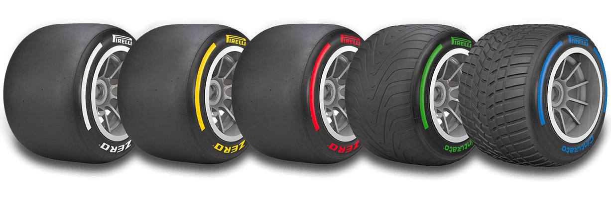
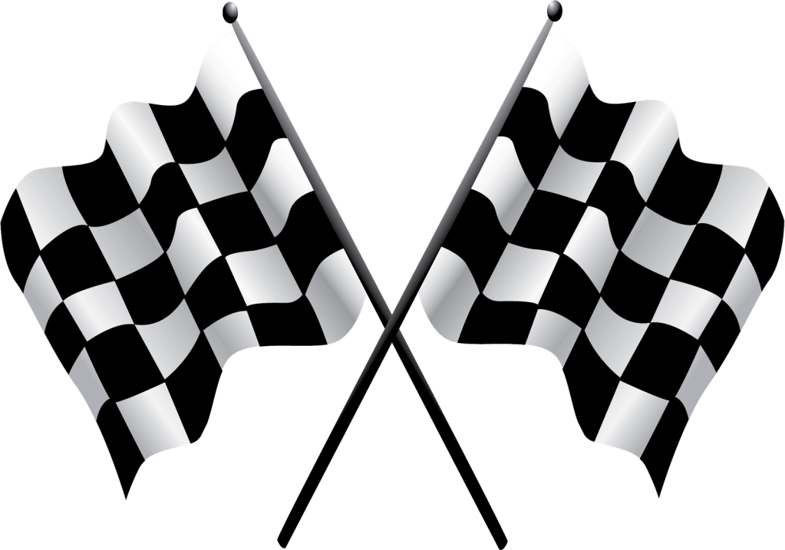
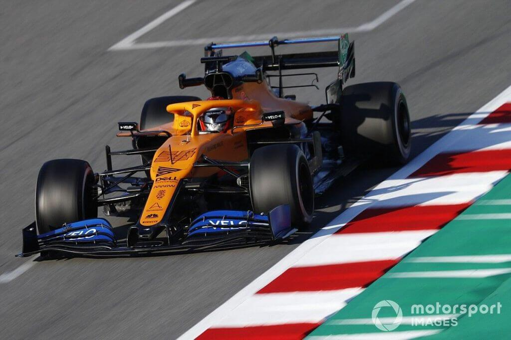
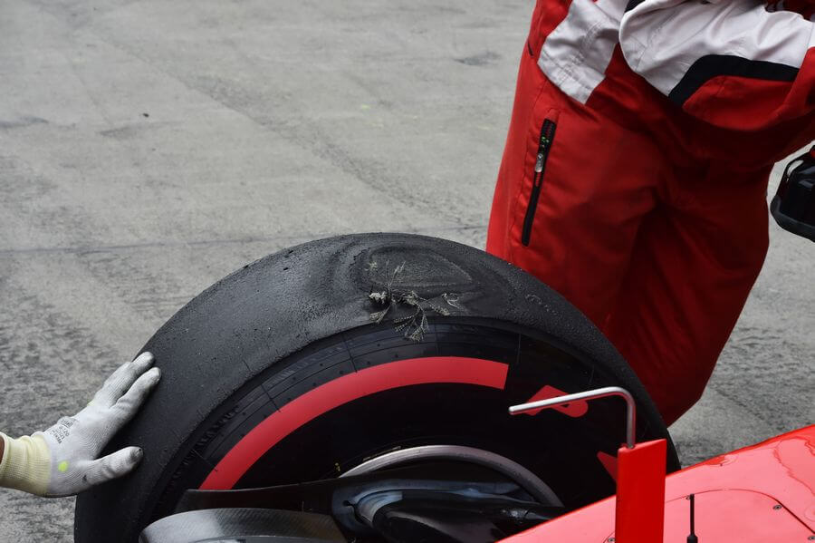
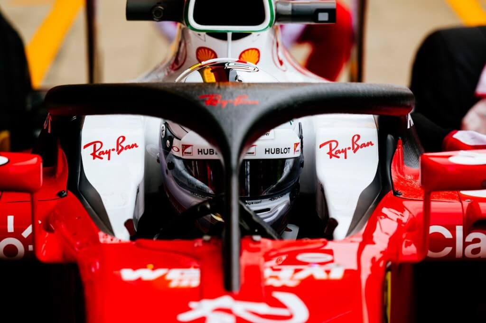

If you haven't read Part 1 then I'd advice you head back to it. Let's continue where we left off.

<!--more-->

## Rules and Regulations

1.  The obvious, no crashing into another driver, no corner cutting, no going backwards and any other you can probably think of.
2.  No illegal blocking of another driver, when defending you are permitted to move just once. You can't zig-zag around.
3.  A driver must have at least one pit stop.
4.  Slow down to the speed limit in the pit lane (80kph for most tracks).
5.  During a dry race, a driver must use two different tyre compounds (more on that later)

Those are the common ones but the commentators will fill you in when something happens. When a crash or something happens that requires marshals or a tractor on track then a safety car (SC) or a virtual safety car (VSC) can be called out. For the SC, the drivers should follow behind the car and not overtake (unless told to) whereas for the VSC, the drivers follow a set lap time effectively this maintains the order and gap between the drivers.

## Tyre Compounds

<figcaption>

Source: [Pirreli](https://www.pirelli.com/tires/en-us/motorsport/f1/tires)
</figcaption>

[Click here for video showcasing the tyre compounds (and naming) as from 2019](https://youtu.be/E1LQ5REb288)

There are main 2 types of tyres: dry (slicks) and wet tyres (grooved). For dry tyres there are 3 compounds:

*   Soft (red walled) - the stickiest compound thus the fastest but does not last long
*   Medium (yellow walled) - middle of the road
*   Hard (white walled) - slowest compound but lasts longest.

As a rule, if a driver starts the race on softs, during their mandated pitstop they should change to the medium or hard compound. This is only applicable during a completely dry race so if it rain this is disregarded.

For wet tyres there are 2 compounds:

*   Intermediates/Inters (green walled) - when there are a few showers of rain
*   Full wets/ Extreme (blue walled) - when it's really pouring on track. This tyre requires more water to cool it. The 2019 extremes cleared 65 litres of water per second at 300kph.

<figcaption>Chequered Flag</figcaption>

## Flags

Flags are common in any motorsport and not just F1. The main flags used in F1 are:

*   Green: pretty obvious, race start or race resumes.
*   Yellow: an accident or something has happened, drivers should slow down at the affected area as well as not overtake there
*   Red: the session has been stopped. This occurs on safety grounds.
*   Blue: waved to drivers about to be lapped to move and allow the leaders to lap them.
*   Black: driver disqualified.
*   Chequered flag: end of the session.
*   Black and white: it is a warning to the driver waved at, similar to yellow card in football.

## Penalties

During a race, there are two main penalties that can be issued, a drive-through penalty or a time penalty. In a drive-through penalty, the driver has to drive through the pit lane (pit lane speed limit of 80kph applies) effectively loosing about 17 seconds but that too depends on the track. For a time penalty, the driver can have the "normal" time penalty or a stop/go penalty. For a normal time penalty, if it's 5 second, then the 5 seconds can be added onto the drivers lap time or if they pit, they should remain stationary for 5 seconds before the pit crew can work on the car. For a stop/go penalty, the driver has to enter the pit lane, stop at their pit box to serve the time then exit without anybody working on the car.

Another type of penalty is a grid penalty which can be issued post or pre-race due to driver mistake or behaviour. So if after qualifying a driver is offered a 3-place grid penalty and they had qualified in P3, then they will start the race in P6. If the penalty is issued after a race then it will be in place at the next race

Other penalties exist such as engine penalties and many more. The commentators will definitely fill you in.

Explained in Glossary. Credit: Motorsport Images

## Glossary

*   DRS - Drag Reduction System - the rear wing opens up allowing air to go through effectively reducing drag and giving the car a sort of "boost".

    <figcaption>Source: Motorsport Images</figcaption>
*   DNF - Did Not Finish - where a driver retires from a race or crashes out
*   DNS - Did Not Start
*   DSQ or DQ - Disqualified
*   "Box this lap" - this is heard when a driver's race engineer wants the driver to pit
*   "Box opposite to" someone - this is heard when the team tells their driver to watch out on another driver, if the other driver pits they do not pit and vice versa
*   Flat spot - this is a term used when during braking a driver locks up their tyre and it rubs on the track on one part creating a part where the tyre is flat. That part continues to rub down during every braking resulting in vibrations and slower lap times.

*   Halo - the half ring above a driver's head. It serves to protect them.

    <figcaption>
    
    Source: [CAR magazine](https://car-images.bauersecure.com/pagefiles/74505/formula1_halo_01.jpg)
    </figcaption>
*   Livery - the aesthetic design of the car in terms of colour, patterns, sponsors etc.
*   Double header - two races spaced one week apart.
*   Grid - the place where cars line up to start a race.

My work is done here, wait for the next race and I'm sure you'll understand most of the things mentioned or seen.

Before I disappear, follow [Chain Bear](https://www.youtube.com/user/chainbearf1) on YouTube and you won't be disappointed with his explanations of different F1 items.

Find me on Twitter, till next time, share this around to your friends and enjoy F1. Peace

