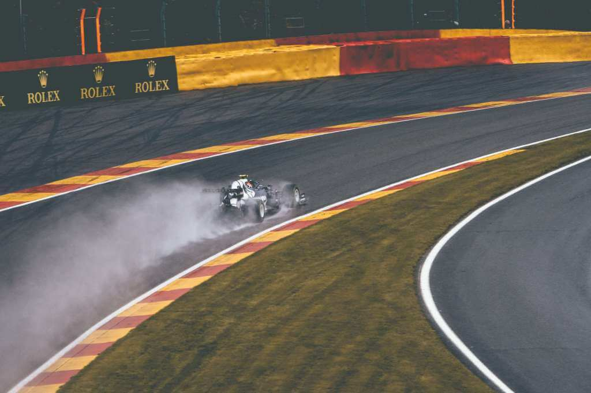
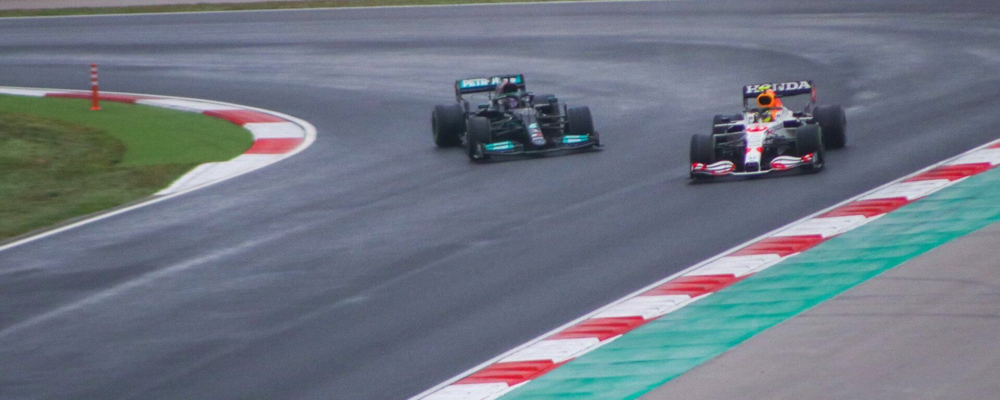
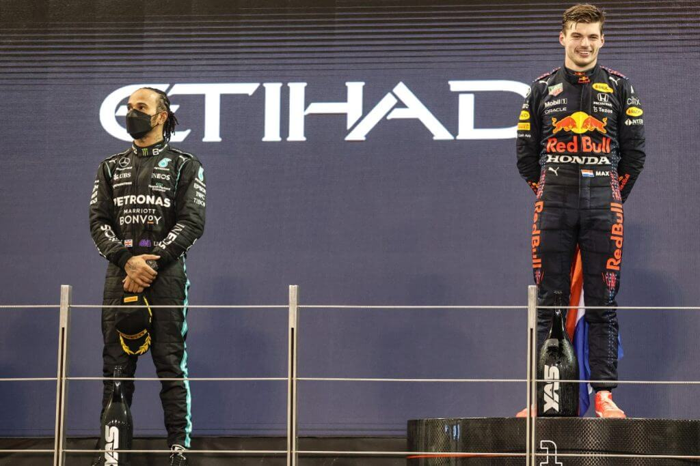

After a tumultuous year that was 2020, Formula 1 came into what many would call the best season in recent years. It is a season that will forever be engraved in the history books with Max Verstappen hoping for his first championship and Lewis intending to break his shared record with Michael Schumacher.

<!--more-->

A rule change was brought and pre-season testing was here but Mercedes and Aston Martin were nowhere in pace compared to Red Bull and some other teams. That is the beginning of the wild ride that was the 2021 F1 season.

Round 1 (Bahrain) came and as expected Red Bull was the fastest team but crucially Mercedes had clawed back some pace. Max struck the first blow by taking pole with Lewis right next to him. The lights went out, Mazepin did not see Turn 4, Mick struggled and Pierre was a little too close to Ricciardo. Towards the end, Max was right behind Lewis who was on ageing tyres. He went for the move outside Turn 4 and sadly for him, finished the overtake off the track. He had to give the position back and that is how he lost the win. 

Imola soon came with Lewis on pole and Max in P3 but by Tamburello chicane, Max was ahead. They pushed each other and when it came to lapping other drivers, Lewis slid off the track into the gravel. He managed to reverse back onto the track but was now down in P9 and a lap down. After a red flag caused by his teammate, Bottas, and Mercedes junior George Russell, Lewis was right back on the lead lap and fought to finish P2 with Max taking the win. 

The next couple of rounds showed the two were a class above the rest of the field and the championship was going to be tight. 

Monaco swang in the favour of Red Bull with Lewis being off the pace the whole weekend finishing P7 while Max took the win. Baku saw a tyre failure for Max from the lead and Lewis ended his run of consecutive points finishes after he went straight down Turn 1 on race restart. Questions were asked on whether the pressure had got to him. 

We got to France and Red Bull took a page out of Mercedes’ Barcelona strategy masterclass earlier in the year giving Max the win with Perez in P3 while the Silver Arrows had to settle for P2 and P4 with Lewis and Bottas respectively. 

<iframe width="560" height="315" src="https://www.youtube.com/embed/4ikWhv-1w5E" title="YouTube video player" frameborder="0" allow="accelerometer; autoplay; clipboard-write; encrypted-media; gyroscope; picture-in-picture" allowfullscreen></iframe>

After Austria and Styria, Mercedes were set to finally bring an upgrade to their car in Silverstone hoping for a good show in front of Hamilton’s home fans. This brought them ahead of Red Bull and from the first Sprint on Saturday, it was clear Lewis had the pace. In the race, Max had a good start but Lewis was right there and at Woodcote, he chose a wider line to get early on the throttle for the run to Corpse corner. This paid off and he was soon wheel to wheel with Max and that is when we had our first major collision. Max was sent into the barrier at an alarming speed but luckily he was okay. Lewis was predominantly at fault which got him a penalty that he served and hunted the other drivers to eventually win. The gap in the championship had been greatly reduced.

Hungary came and Bottas chose to switch from F1 to Bowling taking out a couple of cars by Turn 1. Max dropped back with a damaged car and Lewis somehow found himself in last place after he was the only car on the grid for the race restart. He charged on until he got to Alonso whose herculean defence skills for about 10 laps cost Hamilton some time. Ocon won thanks to avoiding the earlier crash, defending against Vettel who later got disqualified after the race and crucially Alonso's defence. Lewis got P2 with Max down in P9.

<figcaption>

Credit: [Alexandre Brondino](https://unsplash.com/@brondia)
</figcaption>

Spa Francorchamps gave to us the shortest race in F1 history where Max’s pole gave him the win and Lewis took third place but the star of the weekend was George Russell. Lando, too, would have been right up there were it not for a red flag that was a crash too late.

The Dutch fans came in their masses to witness their hero Verstappen. With an impressive track that would sadly be difficult to overtake, qualifying would be crucial. Max drove himself to pole position and come to the end of the Grand Prix, the orange smoke that quite possibly covered the entire country would tell who had won it.  

<iframe width="560" height="315" src="https://www.youtube.com/embed/rbU_iUIay3w" title="YouTube video player" frameborder="0" allow="accelerometer; autoplay; clipboard-write; encrypted-media; gyroscope; picture-in-picture" allowfullscreen></iframe>

Another Sprint weekend was upon us in the shape of the Monza circuit. Hamilton would start the Grand Prix in fourth place but soon he was batting Max who later on had a slow pit stop. Hamilton made his stop from the lead and came out right ahead of Max before he found him on top of him - Red Bull gives you wings.

Verstappen was deemed to be at fault and he got a grid drop for the next race. With that in mind, Red Bull opted to change his engine and start from the back, Lando had a thrilling battle with the 7-time world champ but sadly lost his maiden win by not pitting for wet weather tyres. Lewis won and somehow Max was on the podium. 

<figcaption>

Credit: [Shem Maore](https://twitter.com/MaoreShem)
</figcaption>

Lewis and Mercedes cocked up their strategy in Turkey while Red Bull and Max dominated the US Grand Prix which has always been in favour of Mercedes in the past. The high altitude of Mexico yet again allowed Max to win in a commanding style with Lewis defending against Perez for second place. 

We came to Brazil which was a huge part of this theatrical season. Lewis took a new engine but had a 5 place grid penalty for that, he got a commanding pole position but the drama started post-qualifying. Lewis was disqualified because of the gap on the Mercedes' rear wing exceeding the limit, Max got a fine for touching his wing that he hopes the stewards enjoyed a nice dinner and the Saturday sprint came. In a third of the race distance, Lewis had a masterclass performance and got himself from P20 to P5. What would this man do with a whole race distance? By lap 5, he got from P10 to P3. The fight was on, Perez was soon dispatched and only Max stood in his way. Some questionable defence was seen but Lewis recollected himself and took the win in what is considered one of his best race weekends. 

MotoGP gave way to F1 on their track in Qatar and Lewis continued with his Brazil form, Max drove through to finish second. 

Saudi Arabia was atrocious in track safety and how the FIA (with Michael Masi) conducted themselves but the talk was about the collision between the title contenders. Max was told to give the position back to Lewis who ended up running into his back. Controversy aside, Lewis won the race and equalled his rival in points going into the final race. 

Before the final race, it was evident Max has been consistent all through the year while Lewis has always managed to climb back. It seemed we were back to the first race with the tie and it was going to be the winner takes it all in Abu Dhabi.

Max threw the first punch by taking pole from Lewis who rather looked very spirited for someone who had lost pole. The final "It's lights out and away we go" and Lewis immediately took the lead, Max tried to get through while Hamilton had to resort to using the runoff. In the lead, he created a good gap, pitted to mirror Red Bull's strategy and Perez defended beautifully to get Max closer to Lewis. Red Bull changed strategy and pitted with a few laps to go. It all seemed like Max would not reduce the gap any further until Nicholas Latifi binned it in the hotel section. Max pitted once again under the safety car and cue in the controversy. Race Control notified that lapped car would not overtake, quickly changed on that, just the five lapped cars between Lewis and Max were let through and quickly the safety car period was ended. One more lap of racing to define it all and Lewis tried his best but Max with the fresher tyres overtook him to win the 2021 World Drivers Championship.

As of writing, the driver's championship is not set in stone but coming to the last race, we were all prepared for whatever outcome and whoever got it definitely deserved it. It is clear though that the FIA need to be consistent and dare I say, Michael Masi needs to resign - his work is tough but if he does not improve on some things then maybe we need to try someone else.

All in all, 2021 was a great season for Formula 1 and will be remembered as one of the greatest. Bye 2021, it has been a pleasure.
